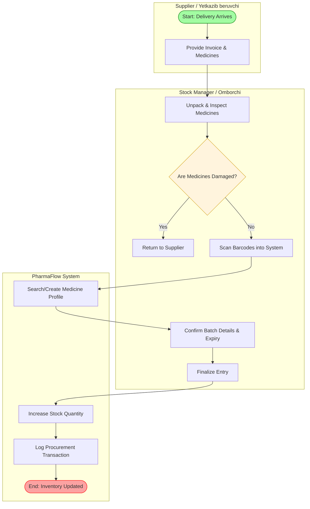

```mermaid
graph TD
    subgraph Supplier [Supplier / Yetkazib beruvchi]
        S1([Start: Delivery Arrives]) --> S2[Provide Invoice & Medicines]
    end

    subgraph Stock_Manager [Stock Manager / Omborchi]
        S2 --> M1[Unpack & Inspect Medicines]
        M1 --> M2{Are Medicines Damaged?}
        M2 -- Yes --> M3[Return to Supplier]
        M2 -- No --> M4[Scan Barcodes into System]
        M5[Confirm Batch Details & Expiry] --> M6[Finalize Entry]
    end

    subgraph System_Lane [PharmaFlow System]
        M4 --> SY1[Search/Create Medicine Profile]
        SY1 --> M5
        M6 --> SY2[Increase Stock Quantity]
        SY2 --> SY3[Log Procurement Transaction]
        SY3 --> SY4([End: Inventory Updated])
    end

    style S1 fill:#a2fca2,stroke:#008000
    style SY4 fill:#fca2a2,stroke:#ff0000
    style M2 fill:#fff4dd,stroke:#d4a017
```
