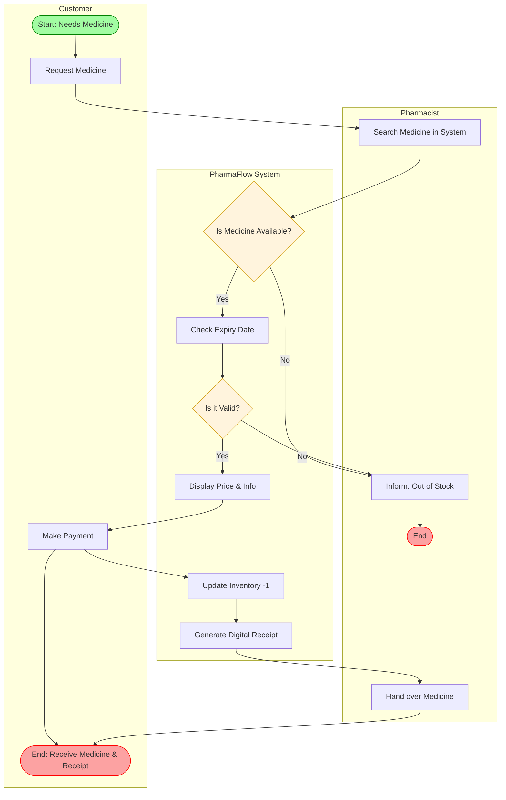

```mermaid
graph TD
    %% Roles/Lanes definition
    subgraph Customer_Lane [Customer]
        A([Start: Needs Medicine]) --> B[Request Medicine]
        L[Make Payment] --> M([End: Receive Medicine & Receipt])
    end

    subgraph Pharmacist_Lane [Pharmacist]
        B --> C[Search Medicine in System]
        G[Inform: Out of Stock] --> N([End])
        K[Hand over Medicine] --> M
    end

    subgraph System_Lane [PharmaFlow System]
        C --> D{Is Medicine Available?}
        D -- No --> G
        D -- Yes --> E[Check Expiry Date]
        E --> F{Is it Valid?}
        F -- No --> G
        F -- Yes --> H[Display Price & Info]
        H --> L
        L --> I[Update Inventory -1]
        I --> J[Generate Digital Receipt]
        J --> K
    end

    %% Styling
    style A fill:#a2fca2,stroke:#008000
    style N fill:#fca2a2,stroke:#ff0000
    style M fill:#fca2a2,stroke:#ff0000
    style D fill:#fff4dd,stroke:#d4a017
    style F fill:#fff4dd,stroke:#d4a017
```
