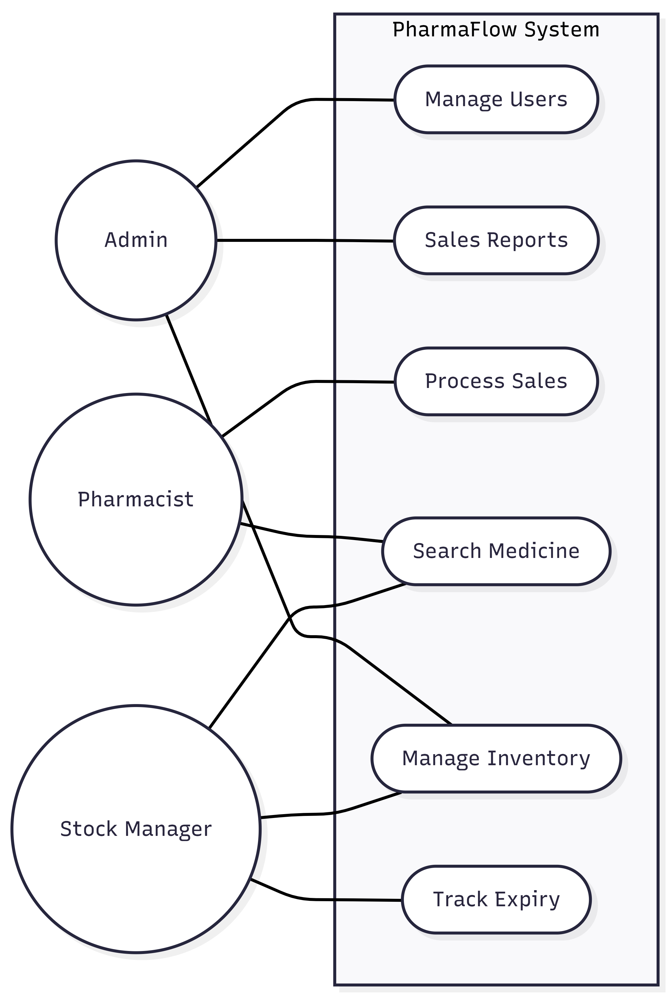

# Week 3: Use Case Diagram - PharmaFlow

## Visual Representation
Below is the Use Case diagram showing the interactions between actors and the system:

## Use Case Descriptions
- **Admin:** Manages users and views reports.
- **Pharmacist:** Searches for medicines and processes sales.
- **Stock Manager:** Controls inventory and tracks expiration dates.
