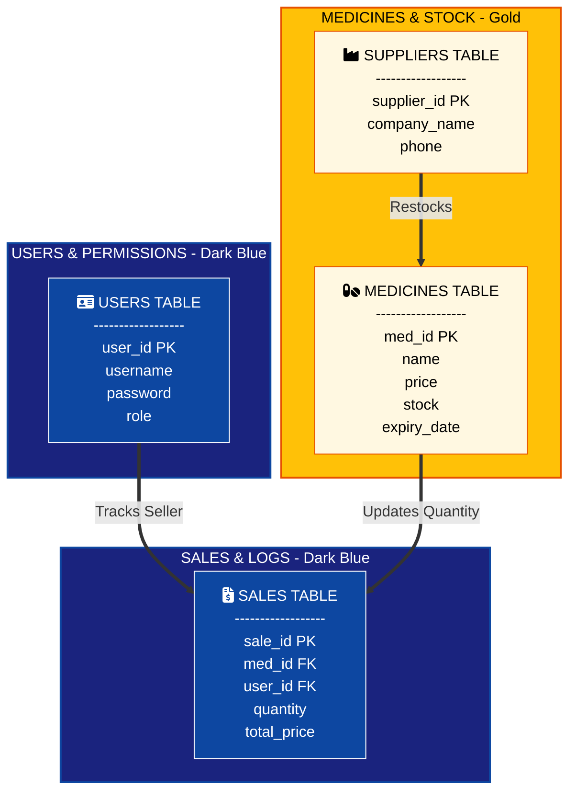

## Database Architecture - Week 4

The **PharmaFlow** database is structured into three main modules, similar to our business process flow:

1. **User Management (Dark Blue):** Handles authentication and authorization. It records which employee (Admin/Pharmacist) is using the system.
2. **Inventory System (Gold):** Manages the products. It links each medicine to its supplier and tracks stock levels automatically.
3. **Transaction System (Dark Blue):** The core of the POS. Every sale is linked to a specific medicine and a specific user to ensure accountability.

**Relationships:**
- **Primary Keys (PK):** Unique IDs for each entry.
- **Foreign Keys (FK):** Used to create relationships between tables (e.g., Sales table links to both Medicines and Users).
