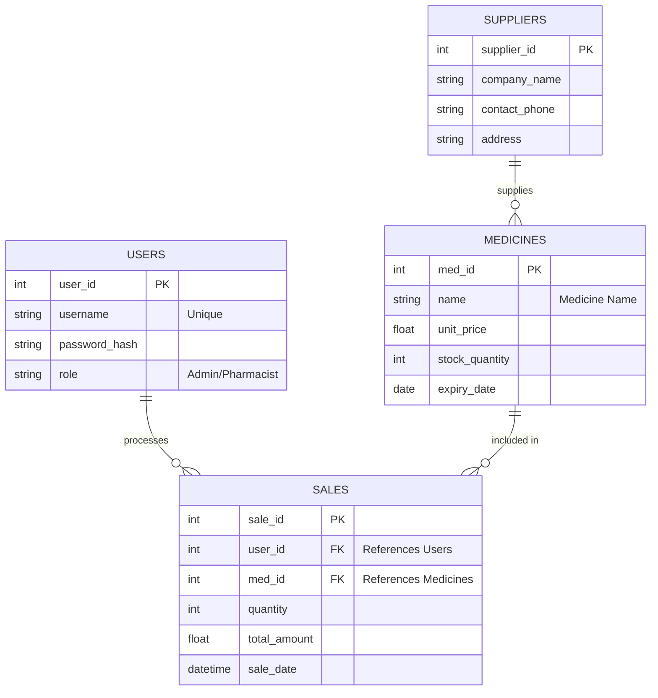

## Database Architecture - Week 4

The **PharmaFlow** database is structured into three main modules, similar to our business process flow:

1. **User Management (Dark Blue):** Handles authentication and authorization. It records which employee (Admin/Pharmacist) is using the system.
2. **Inventory System (Gold):** Manages the products. It links each medicine to its supplier and tracks stock levels automatically.
3. **Transaction System (Dark Blue):** The core of the POS. Every sale is linked to a specific medicine and a specific user to ensure accountability.

**Relationships:**
- **Primary Keys (PK):** Unique IDs for each entry.
- **Foreign Keys (FK):** Used to create relationships between tables (e.g., Sales table links to both Medicines and Users).
Table,Field,Data Type,Description
Users,role,String,Foydalanuvchi huquqi (Admin/Pharmacist)
Medicines,stock,Integer,Ombordagi qoldiq soni
Medicines,expiry,Date,Dorining amal qilish muddati
Sales,total,Decimal,Sotuvning umumiy summasi
-- PharmaFlow Database Structure (PostgreSQL/MySQL)
```sql
CREATE TABLE Users (
    user_id SERIAL PRIMARY KEY,
    username VARCHAR(50) UNIQUE NOT NULL,
    role VARCHAR(20) CHECK (role IN ('Admin', 'Pharmacist'))
);

CREATE TABLE Medicines (
    med_id SERIAL PRIMARY KEY,
    name VARCHAR(100) NOT NULL,
    price DECIMAL(10, 2) NOT NULL,
    stock_quantity INT DEFAULT 0,
    expiry_date DATE NOT NULL
);

CREATE TABLE Sales (
    sale_id SERIAL PRIMARY KEY,
    user_id INT REFERENCES Users(user_id),
    med_id INT REFERENCES Medicines(med_id),
    quantity INT NOT NULL,
    total_amount DECIMAL(10, 2),
    sale_date TIMESTAMP DEFAULT CURRENT_TIMESTAMP
);
