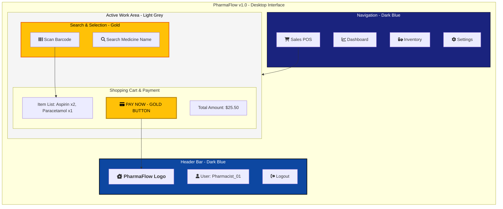

## 🎨 UI/UX Design Strategy

### 1. Visual Identity
- **Primary Color (Dark Blue):** Chosen for the Header and Sidebar to evoke a sense of trust, stability, and professionalism in a medical environment.
- **Action Color (Gold):** Used for critical call-to-action buttons like "Pay Now" and "Search." This ensures the pharmacist's attention is immediately drawn to the most important tasks.

### 2. User Experience (UX) Goals
- **Efficiency:** The POS (Point of Sale) screen is optimized for high-speed transactions. Results appear instantly as the pharmacist types, reducing customer wait times.
- **Hierarchy:** Critical information, such as the "Total Amount," is centered and highlighted in Gold to prevent errors during busy hours.

### 3. Layout Breakdown
- **Sidebar:** Allows 1-click navigation between Inventory, Sales, and Reports.
- **Main Content:** A clean, high-contrast workspace that works well on both desktop monitors and tablets.
